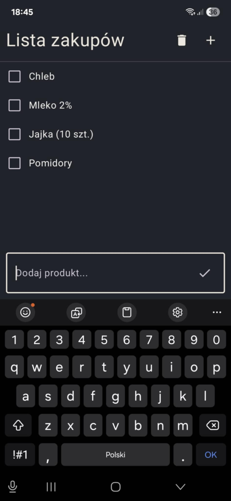
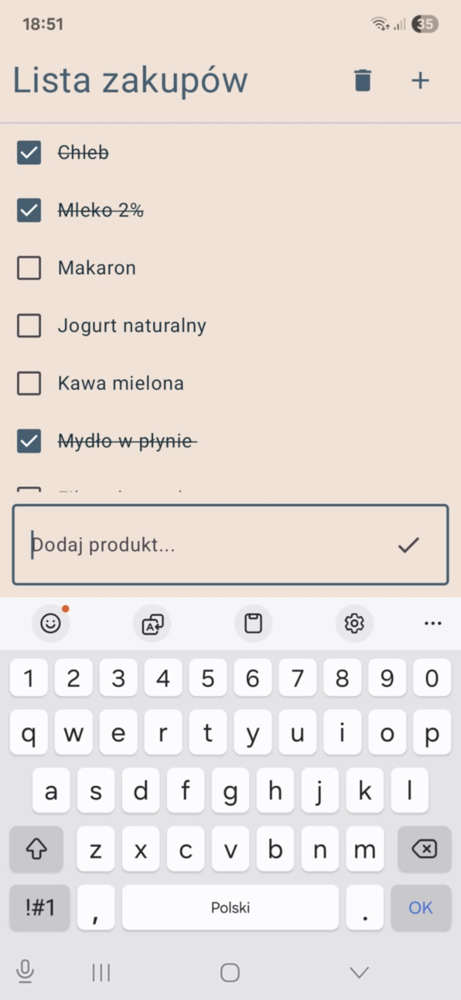
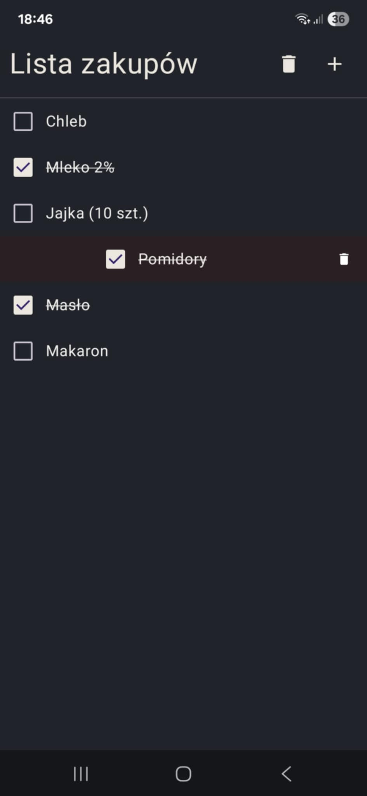
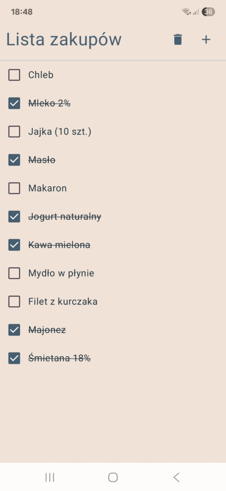
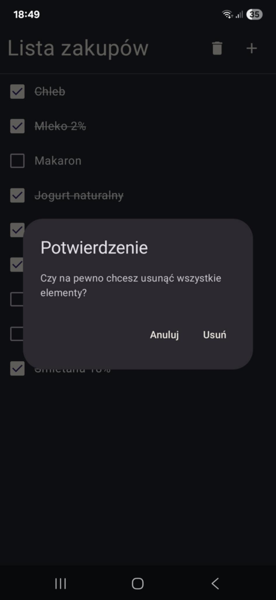

# Shopping List App

Prosta aplikacja na Androida stworzona w Kotlinie z użyciem Jetpack Compose.  
Projekt powstał jako nauka podstaw UI, zarządzania stanem i przechowywania danych w DataStore.

## Funkcje
- Dodawanie nowych elementów do listy
- Oznaczanie produktów jako kupione
- Usuwanie pojedynczych elementów (gest *swipe*)
- Usuwanie całej listy z potwierdzeniem
- Automatyczne zapisywanie i wczytywanie listy z DataStore
- Obsługa jasnego i ciemnego motywu systemowego

## Screenshots

  
  

  
  
  

## Technologie
- *Kotlin*
- *Jetpack Compose*

## Struktura projektu (wersja edukacyjna)
Wszystko mieści się jeszcze w jednym pliku MainActivity.kt - projekt służył jako nauka Compose i podstaw aplikacji mobilnych.  

## Status projektu
✅ Zakończony (wersja 1.0 – projekt edukacyjny)  
